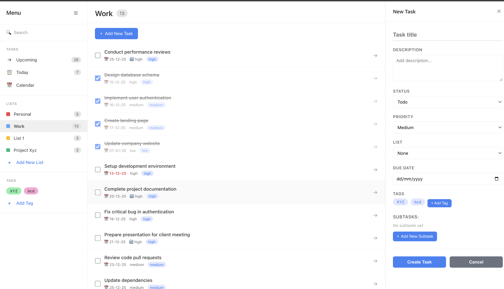
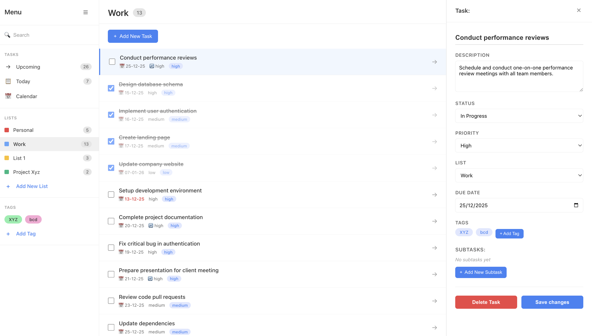

# Task Manager - Full-Stack Application

## 📋 Project Overview

A clean, production-quality Task Manager application with a modern three-column layout. Built with Next.js, FastAPI, and Supabase, demonstrating full-stack development with proper separation of concerns, human-readable code, and comprehensive error handling.

**Key Features:**
- Three-column UI: Sidebar navigation, task list, and details panel
- Complete CRUD operations for tasks
- Subtasks, lists, and tags support
- Real-time task filtering and search
- Responsive design for all screen sizes

**💡 AI Features**: See `docs/AI_FEATURES_SUGGESTIONS.md` for AI enhancement ideas like natural language task creation, smart prioritization, and intelligent search.

## 🛠 Tech Stack

### Frontend Technologies
- **Next.js 14** - React framework with App Router for server-side rendering and routing
- **TypeScript** - Type-safe JavaScript for better code quality and developer experience
- **React 18** - UI library with hooks for state management and component lifecycle
- **Custom CSS** - No external UI frameworks, ensuring lightweight and customizable styling

### Backend Technologies
- **FastAPI** - Modern, fast Python web framework with automatic API documentation
- **Python 3.8+** - Backend programming language known for readability and maintainability
- **Pydantic** - Data validation library using Python type annotations
- **Uvicorn** - Lightning-fast ASGI server for running FastAPI applications

### Database & Infrastructure
- **Supabase** - Open-source Firebase alternative providing backend-as-a-service
- **PostgreSQL** - Robust relational database (hosted via Supabase)
- **Supabase Python Client** - Official Python SDK for database operations

### Development Tools
- **Node.js 18+** - JavaScript runtime for frontend development
- **npm** - Package manager for Node.js dependencies
- **Python Virtual Environment** - Isolated Python environment for dependency management
- **Git** - Version control system

## 🚀 How to Install & Run Backend

### Prerequisites
- Python 3.8+ installed
- Supabase account (free tier works fine)

### Step 1: Navigate to Backend Directory
```bash
cd backend
```

### Step 2: Create Virtual Environment
```bash
python -m venv venv
source venv/bin/activate  # On Windows: venv\Scripts\activate
```

### Step 3: Install Dependencies
```bash
pip install -r requirements.txt
```

### Step 4: Configure Environment Variables
Copy the example environment file and add your Supabase credentials:
```bash
cp .env.example .env
```

Edit `backend/.env` and add your Supabase credentials:
```env
SUPABASE_URL=your_supabase_project_url
SUPABASE_KEY=your_supabase_anon_key
```

**Note**: The `.env.example` file is provided as a template. Do NOT commit your actual `.env` file with real keys.

### Step 5: Run the Backend Server
```bash
uvicorn main:app --reload
```

The backend will be running at `http://localhost:8000`

You can test it by visiting:
- **API**: http://localhost:8000
- **API Documentation**: http://localhost:8000/docs

## 🚀 How to Install & Run Frontend

### Prerequisites
- Node.js 18+ and npm installed
- Backend server running (see above)

### Step 1: Navigate to Frontend Directory
```bash
cd frontend
```

### Step 2: Install Dependencies
```bash
npm install
```

### Step 3: Configure Environment Variables (Optional)
If your backend runs on a different port, copy the example file:
```bash
cp .env.local.example .env.local
```

Edit `frontend/.env.local` and set the API URL:
```env
NEXT_PUBLIC_API_URL=http://localhost:8000
```

**Note**: The `.env.local.example` file is provided as a template. The default API URL is `http://localhost:8000`.

### Step 4: Run the Development Server
```bash
npm run dev
```

The frontend will be running at `http://localhost:3000`

Open your browser and navigate to http://localhost:3000 to see the application.

## 🗄️ How to Set Up Supabase

### Step 1: Create Supabase Project
1. Go to [supabase.com](https://supabase.com) and sign in
2. Click "New Project"
3. Fill in your project details:
   - **Name**: Task Manager (or your choice)
   - **Database Password**: Choose a strong password
   - **Region**: Select the closest region
4. Click "Create new project" and wait for it to initialize

### Step 2: Create the Tasks Table
1. Go to your Supabase project dashboard
2. Click on **SQL Editor** in the left sidebar
3. Click **New query**
4. Copy and paste the following SQL code:

```sql
-- Task Manager Database Schema
-- Run this SQL in your Supabase SQL Editor to create the tasks table

create table tasks (
  id uuid default gen_random_uuid() primary key,
  title text not null,
  description text,
  priority text,
  status text,
  due_date date,
  list text,
  subtasks jsonb default '[]'::jsonb,
  created_at timestamptz default now(),
  updated_at timestamptz default now()
);

-- Optional: Add indexes for better query performance
create index idx_tasks_status on tasks(status);
create index idx_tasks_priority on tasks(priority);
create index idx_tasks_due_date on tasks(due_date);
create index idx_tasks_created_at on tasks(created_at);
create index idx_tasks_list on tasks(list);
create index idx_tasks_subtasks on tasks using gin (subtasks);
```

5. Click **Run** (or press `Ctrl+Enter` / `Cmd+Enter`)
6. You should see a success message confirming the table was created

### Step 3: Get Your Supabase Credentials
1. In your Supabase project dashboard, go to **Settings** → **API**
2. Copy the following values:
   - **Project URL** - This is your `SUPABASE_URL`
   - **anon public** key - This is your `SUPABASE_KEY` (use the `anon` key, not the `service_role` key)
3. Add these credentials to your `backend/.env` file (see Backend Setup above)

### Step 4: (Optional) Seed Sample Data
If you want to add sample tasks for testing:

**Option A: Using SQL**
1. Go to SQL Editor in Supabase
2. Copy and paste the contents of `database/seed.sql`
3. Click Run

**Option B: Using Python Script**
```bash
./scripts/seed-database.sh
```

## 📸 Screenshots

### Task List Page



*The main dashboard showing the three-column layout:*
- **Left Sidebar**: Navigation with Today (7 tasks), Upcoming (26 tasks), Lists (Personal, Work, List 1, Project Xyz), and Tags
- **Middle Panel**: Task list for the selected list (Work) with 13 tasks, showing checkboxes, due dates, and priority tags
- **Right Panel**: New task creation form with all fields including title, description, status (Todo), priority (Medium), list (Work), due date, tags, and subtasks

### Create/Edit Task Page



*The task details panel showing editing capabilities:*
- **Left Sidebar**: Navigation panel with task counts and lists
- **Middle Panel**: Task list with "Setup development environment" selected (highlighted)
- **Right Panel**: Task details panel showing:
  - **Task Title**: "Setup development environment"
  - **Description**: Full task description
  - **Status**: Todo (dropdown)
  - **Priority**: High (dropdown)
  - **List**: Work (dropdown)
  - **Due Date**: 13/12/2025
  - **Tags**: XYZ and bcd tags with ability to add more
  - **Subtasks**: "work on it" subtask with delete option
  - **Actions**: Delete task and save changes buttons

## 📁 Project Structure

```
Task Manager/
├── backend/                 # FastAPI backend
│   ├── app/
│   │   ├── database.py      # Supabase client initialization
│   │   ├── models.py        # Pydantic models for validation
│   │   └── routers/
│   │       └── tasks.py     # Task CRUD endpoints
│   ├── main.py              # FastAPI application entry point
│   ├── requirements.txt     # Python dependencies
│   ├── .env.example         # Environment variables template
│   └── .env                 # Environment variables (not in git)
│
├── frontend/                # Next.js frontend
│   ├── app/                 # Next.js App Router
│   ├── components/          # React components
│   ├── services/            # API service layer
│   ├── types/               # TypeScript type definitions
│   ├── utils/               # Utility functions
│   ├── package.json         # Node.js dependencies
│   ├── .env.local.example   # Environment variables template
│   └── .env.local           # Environment variables (not in git)
│
├── database/                # Database schema and migrations
│   ├── schema.sql           # Complete database schema
│   └── seed.sql             # Seed data
│
├── docs/                    # Documentation
├── scripts/                 # Utility scripts
└── screenshots/             # Application screenshots
```

## 📡 API Endpoints

The backend provides the following RESTful endpoints:

- `GET /` - API health check
- `GET /tasks` - Get all tasks
- `GET /tasks/{id}` - Get a single task by ID
- `POST /tasks` - Create a new task
- `PUT /tasks/{id}` - Update an existing task
- `DELETE /tasks/{id}` - Delete a task

Visit http://localhost:8000/docs for interactive API documentation.

## 🔒 Security Notes

- Never commit `.env` files to version control
- Use environment variables for all sensitive data
- The `.env.example` files are provided as templates without real keys
- In production, restrict CORS origins to your frontend domain

## 📚 Additional Documentation

- **Deployment**: See `VERCEL_DEPLOYMENT.md` for Vercel deployment guide
- **Troubleshooting**: See `docs/TROUBLESHOOTING.md` for common issues and solutions
- **Project Structure**: See `docs/PROJECT_STRUCTURE.md` for detailed code organization
- **Coding Standards**: See `docs/CODING_STANDARDS.md` for coding best practices
- **Requirements**: See `REQUIREMENTS_CHECKLIST.md` for requirements verification

---

**📋 Requirements Checklist**: See `REQUIREMENTS_CHECKLIST.md` for a complete verification of all requirements.
